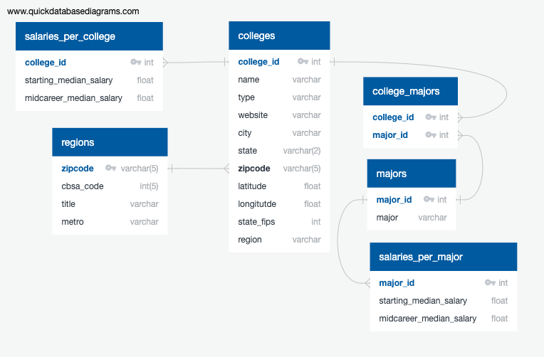

## Project 2: ETL Challenge

This project was completed by Thomas, Ahmad and Tajahnei.

The project will examine a database with data showing the average salary per college major and if certain schools award you a higher salary over the course of your career. The reader can determine if the salary increase outweighs the cost of the degree at more expensive schools. It has been aggregated at 'college_type' which will tell us if there's any pattern in salary growth amoung public or private institutions. After researching census data, we were able to cross reference the salary at each school with the zipcode to measure the average salary in each region. The process involved collecting standardized data from 4 sources and identifying real world considerations when choosing a college.

## Data Sources: 
WSJ - Salaries by college, region, and academic major
* https://www.kaggle.com/wsj/college-salaries

U.S. Department of Education - College Scorecard
* https://collegescorecard.ed.gov/data/

U.S. Census Bureau - Core-based statistical area (CBSA) data
* https://www2.census.gov/programs-surveys/metro-micro/geographies/reference-files/2018/delineation-files/list1.xls

HUD-USPS ZIP Crosswalk Files
* https://www.huduser.gov/portal/datasets/usps_crosswalk.html#data

### These are the steps that were taken:

1. The database schema was defined [quickdatabasediagrams.com](https://app.quickdatabasediagrams.com) as follows:

 

2. The export function was used to predefine the database in PostgresSQL (see [db_schema.sql](schema/db_schema.sql))

3. Once the database is designed, the ETL process can run.

### __EXTRACT__:
First, the following data sources are loaded using Pandas read_csv and read_excel, sometimes requiring looping through numerous files in a directory. CSV and Excel files can be found in the data folder.

1. MERGED2018_19_pp.csv - [source collegescorecard.ed.gov](https://collegescorecard.ed.gov/data/)
2. salaries-by-region-id.csv [source kaggle.com](https://www.kaggle.com/wsj/college-salaries)
3. salaries-by-college-type-id.csv [source kaggle.com](https://www.kaggle.com/wsj/college-salaries)
4. zipcode_cbsa_crosswalk_2018.csv [source huduser.gov](https://www.huduser.gov/portal/datasets/usps_crosswalk.html#data)
5. 2018_cbsa.xls [source census.gov](https://www2.census.gov/programs-surveys/metro-micro/geographies/reference-files/2018/delineation-files/list1.xls)
6. CollegeScorecardDataDictionary.xlsx [source collegescorecard.ed.gov](https://collegescorecard.ed.gov/data/)
7. degrees-that-pay-back.csv [source kaggle.com](https://www.kaggle.com/wsj/college-salaries)

### __TRANSFORM__:

Datasource 1.

Step 1 - Create College Scorecard Data Dictionary (colleges table)
Step 2 - keep only the first 5 characters of the zip code, select currently operating schools, select degree granting schools only, filter data and save as updated dataframe (colleges table)
Step 3 - columns renamed as user friendly labels for use in database (colleges tables)
Step 4 - drop last two rows (colleges table)
Step 5 - update region names using the data dictionary provided by College Scorecard (colleges table)

Datasource 2.

Step 1 - drop any rows with a missing college id (colleges table)
Step 2 - convert the college id to an integer (colleges table)
Step 3 - rename the `UNITID` column to `college_id` ( To join with college_type, colleges, and salaries_per_college) 
Step 4 - sort college_id & reset index (schools dataframe --> colleges table)
Step 5 - Import school types from Kaggle CSV file (colleges table)
Step 6 - drop any rows with a missing college id (colleges table)
Step 7 - convert the college id to an integer &  rename the UNITID column to college_id ( to join college_type, colleges, and salaries_per_college tables on college_id)
Step 8 - update school types of Party or State to Public (college_types table)
Step 9 - drop duplicates(college_types table)
Step 10 - remove data for schools that no longer exist (college_types table)
Step 11 - remove dollar sign from salary and transform salary columns to float in salaries_per_major and college_type tables
Step 12 - rename columns so that all tables have school names and majors under column with the same name (college_type, colleges, and salaries_per_major tables)
Step 13 - merge Kaggle schools data with Scorecard schools data on college_id (colleges table)
Step 14 - replace missing Kaggle school type with Scorecard school type (colleges & college_type table)
Step 15 - delete unneeded columns & rename needed columns to name column (to match college_types with colleges table)
Step 16 - set college id as the index (to join colleges, college_type, and salary_per_college)

Datasource 3. 

Step 1 - rename columns (regions table)
Step 2 - drop any duplicate rows (regions table)
Step 3 - sort table by zip code (regions table)

Datasource 4.

Step 1 - drop any duplicate rows (regions table)
Step 2 - replace missing csa titles with the cbsa title (regions table)
Step 3 - sort table by zip code (regions table)
Step 4 - reset the index (regions table
Step 5 - make sure that the cbsa codes are integers (regions table)
Step 6 - delete unneeded columns (regions table
Step 7 - drop rows with any missing data (regions table
Step 8 - restructure columns (regions table)
Step 9 - Glassdoor Metro Areas and lookup keys (regions table)
Step 10 - create metro column in table with default string 'N/A' (regions table)
Step 11 - loop through lookup keys (regions table)
Step 12 - set glassdoor metro name where lookup key is found in CBSA title (regions table)

Datasource 3. & 4.

Step 1 - merge transformations into one table for storing to the database (regions table)
Step 2 - drop any duplicate rows (regions table)
Step 3 - drop rows with any missing data (regions table)
Step 4 - reset the index (regions table
Step 5 - make sure that the codes are integers (regions table)
Step 6 - set zipcode as the index (regions table)

### __LOAD__: 
The tables have all been created in Pandas DataFrames and the tables are loaded to PostgresSQL database using SQLAlchemy. Everytime this program is run it will overwrite the tables in the database.
